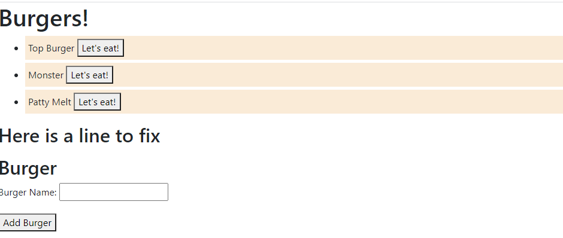

# The Burger Logger
  "Eat-Da-Burger! is a restaurant app that lets users input the names of burgers they'd like to eat."
   
  https://mysterious-coast-61957.herokuapp.com/
  ## Table of Contents
  * [Demo](#demo)
  * [Installation](#installation)
  * [Developer's Information](#devInfo)
  * [Credientials](#credientials)
  * [License](#license)
  
  ## Demo
  THE APPLICATION IS CURRENTLY INCOMPLETE. CSS still needs to be implemented and currently there are some unknown syntax errors causing issues with mySQL, which is stopping the application from having full functionality. 
  
  ## Installation
  When using from heroku, no installment is necessary
  ## Developer's Information
  Feel free to contact me using the information below if you have any questions or feedback!
   
  Name: Jacob Beeson
   
  Github Link: github.com/jpbeeson
   
  Email: <beeson.jp@gmail.com>
  ## Credientials
  All credientials can be found within the credientials.md folder under the public folder of this github repo.
  ## License
  MIT
